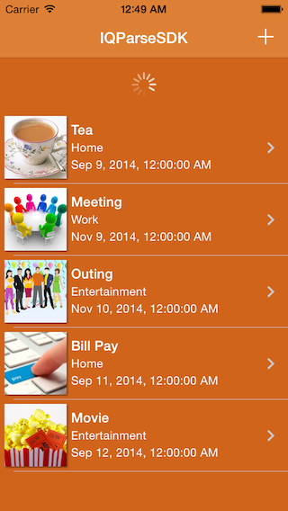

IQParseSDK
==========

   **IQParseSDK** is unofficial Open Source implementation of **Parse iOS SDK** using **Rest API** exposed by parse.com. It allows user to do parse queries and get objects without integrating Parse iOS SDK.
   

Screenshot
----------

[]

Recommendation
----------
If you need to do simple queries, storing, retrieving simple data, then you can go with IQParseSDK, but If you need to do complex queries and want a high command over parse database then I would recommend you to go with ***Official Parse iOS SDK*** provided by parse.com.

LICENSE
---
Distributed under the MIT License.

Contributions
---
IQParseSDK is under development to enhance it more. Any contribution is more than welcome! You can contribute through pull requests and issues on GitHub.

Author
---
If you wish to contact me, email at: hack.iftekhar@gmail.com

